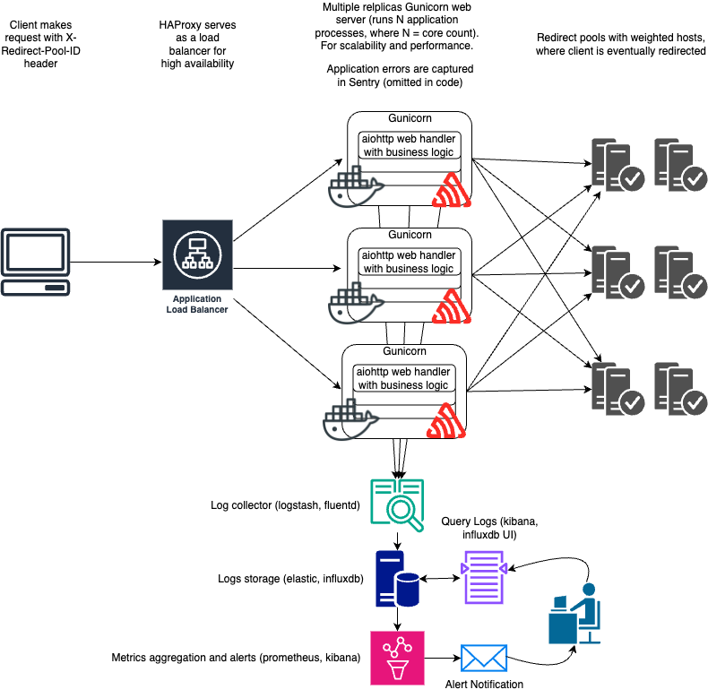

# Redirect Project


## Glossary

1. [Description](#description)
2. [Terminology](#terminology)
3. [Functional Requirements Compliance](#functional-requirements-compliance)
4. [Non-Functional Requirements Compliance](#non-functional-requirements-compliance)
5. [Configuration](#configuration)
6. [Project structure](#project-structure)
7. [Run using docker compose](#run-using-docker-compose)
8. [System design](#system-design)
9. [Setup Python](#setup-python)


## Description

Accepts a client request and redirects to corresponding host accordingly to configuration of the redirect pool used. Redirect pool can be specified using `X-Redirect-Pool-ID` header in request (out-of-the-box configuration declares the following pools: `pool-a`, `pool-b` and `pool-c`), but is not mandatory (default one will be used as a fallback). HTTP scheme, path and query string parameters of the original request are preserved in redirected location. All HTTP methods are supported, please use status code 307 in pool configuration for methods that include request body, to inform client to resend them on redirect.

If there is a possible redirect loop (original host and target host are same value) - service will respond with status code 422.

## Terminology

- Redirect Pool == Domain (Host) Pool from assignment
- Origin == target host where client is eventually redirected

## Functional Requirements Compliance

- [x] Code-less concept, reusable libraries are used for most part of the application, including the main business logic algorithm (`roundrobin` library). Code could be more concise in some places, but I wanted to keep it modular, testable and extendable (by introducing service layer which is decoupled from web framework).
- [x] Configuration that can be done by engineer using config file. Number of possible pools to configure is limited by amount of RAM.
- [x] Client can specify redirect pool id in request header
- [x] Service will redirect client request using weighted approach (a host with a weight of 2 will be used twice as often as a host with a weight of 1), 2 last tests in `tests/test_redirect.py` - test distribution of this algorithm.
- [ ] This is implemented partially. Redirect service omits queryable access logs to stdout (log record includes requested pool id and redirect Location), but logs are not being collected for further storage or aggregation (I am out of time unfortunately)

## Non-Functional Requirements Compliance

- [x] Service is highly available, as it runs multiple replicas behind a load balancer with health check configuration.
- [x] Service shows decent performance (as for a server written in Python), asynchronous web handlers are used, no blocking or slow operations are included, all requests are handled it was simply handling 50k requests per second with reasonable latencies on my laptop. Peak performance is accomplished when logging to stdout is disabled, in real world scenario we would use async or buffered logging to log collector anyway.
- [x] Service proportinally scales horizontally by both increasing number of replicas running gunicorn web server and number of application process are spawned (defaults to number of available cores). My approximation is that single replica might handle 5-10k requests per second (on 1-2 cores instance).
- [ ] Observability has not implemented unfortunately, this would be a time consuming task itself and I am running short on time. However - I have described this party in system design diagram.

## Configuration

Configuration is done via `redirect_pools_config.toml`, where you can declare redirect pools with their corresponding weighted hosts. Each redirect pool can also declare a redirect status code (302 by default). We need a default redirect pool for a case when `X-Redirect-Pool-ID` header is missing in request or it's value is unknown, hence at least one redirect pool should have `is_default = true` attribute (application with fail to start with validation error otherwise). Use `REDIRECT_POOLS_CONFIG_PATH` override default configuration path if necessary.

## Project structure

Main implementation is in `redirect` directory, `misc` directory includes helper files for docker containers we run as a demo. `tests` directory includes python application tests.

## Run using docker compose

This will demonstrate non-functional requirements, like high availability and scalibility

```bash
docker compose up
```

This will run all the necessary services and then conduct a load testing using `wrk`

## System design

System design is briefly describe in the following diagram. This diagram shows corresponding design for the current code implementation, cloud based solutions might vary drastically.

Unfortunately I haven't managed to implement observability (queryable logs) implementation as it might require extra time which I don't currently have :| But I have included this part in diagram, to show potential implementation.

Servers for weighted hosts serv a spawned as origin instances in docker compose (simple hello world web handler that catches all paths), even though they are not really required (wrk does not follow redirects), but I decided to include them as well for integrity of the system.



### Error tracking

This is left out of scope, in production we'd use Sentry (or similar) for that purpose

### Other possible solutions

The easiest implementation would be using cloud provider services, most of each support environments to run docker image containers (with {auto}scaling support for performance), including load balancers for high availability and redundancy (fault tolerance). Also, all of those services have a centralized logs storage, where logs can be easily queried + alerts can be added on certain patterns and thresholds.

Another approach with code-less concept in mind would be usage of Cloudflare Workers, although logs collection would be somewhat problematic in that case.

## Setup Python

You might need it only for local development, this is not required if you run everything using docker compose.

### Prerequisites

Make sure you have Python 3.12+ installed, if you use pyenv with automatic environment activation, you can create a virtualenv named `redirect`.

### Install python package

```bash
pip install -U pip
pip install -e .[dev]
```

### Setup pre-commit

```bash
pre-commit
```

### Run tests

```bash
pytest
```

### Run service

```bash
python redirect/server.py
```
